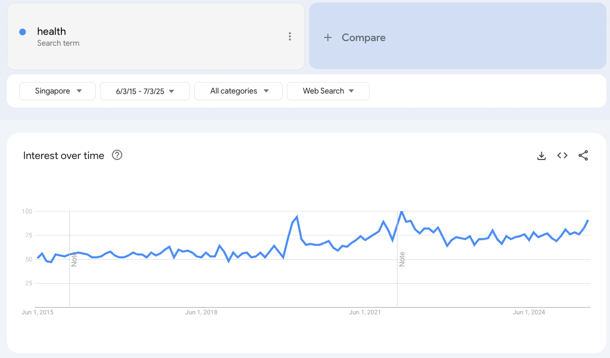
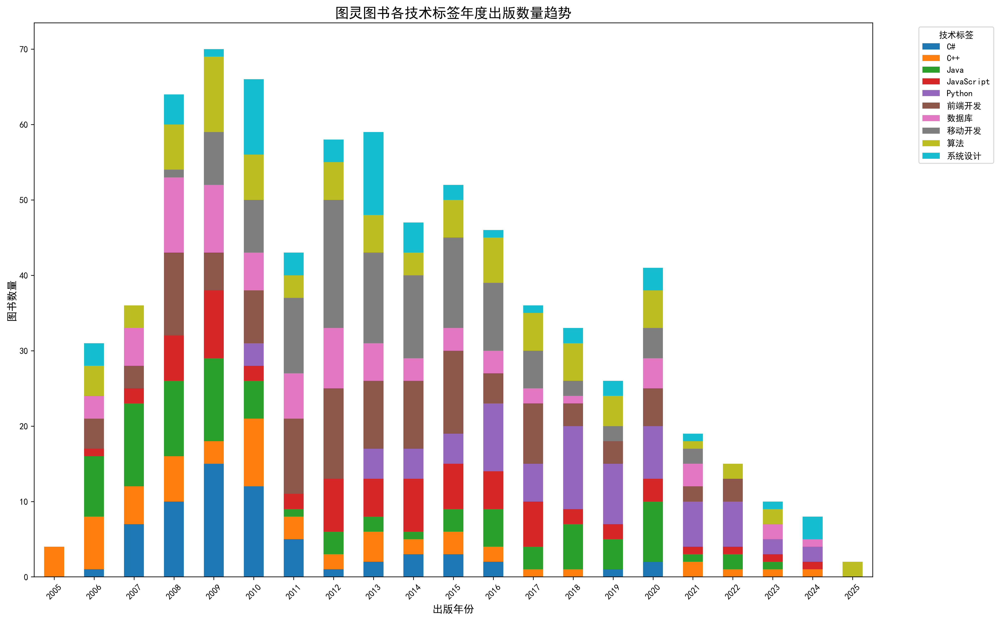
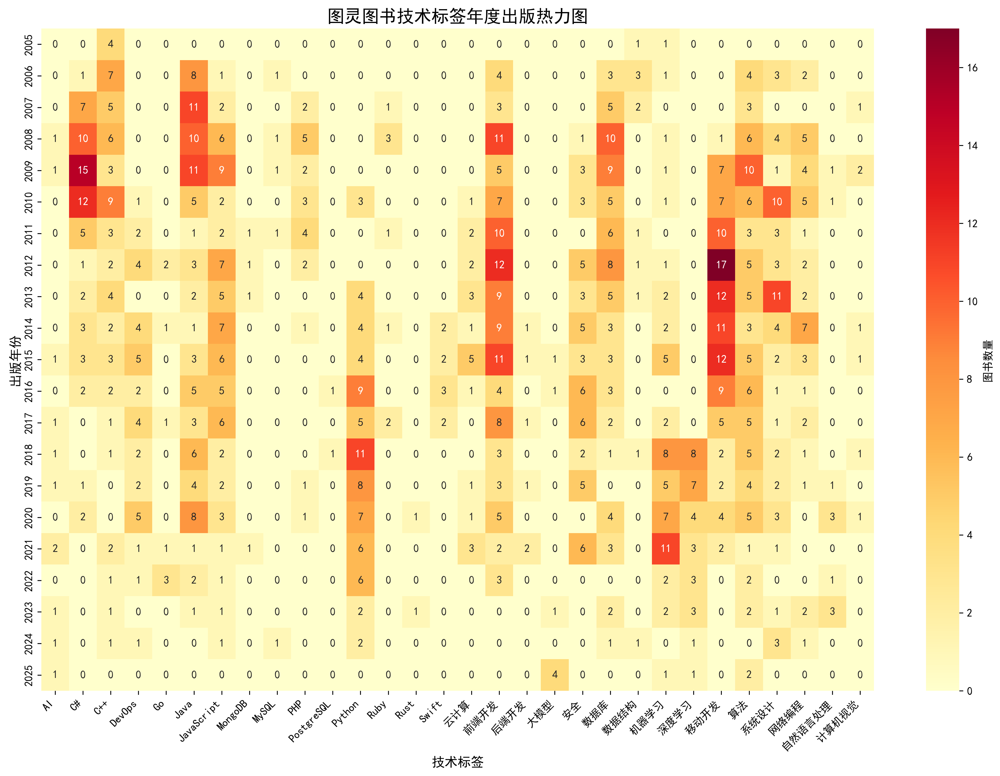

起因是去年我和一位出版社的编辑朋友聊天，表达了我想要写一本关于React入门书籍的想法。她委婉的拒绝了我，原因有二：1）一进入行业的从业者在大幅度减少；2）前端开发受AI的冲击最大，因此前端开发有关书籍的销量都是大幅度下降的。

虽然一年过去了但我依然对这个“消息”充满了好奇：我知道软件开发行业已经大不如前，可究竟处于一个什么样的状态？虽然我们无法精准的知晓每个公司招聘计划的缩减等精确数字，但也许可以通过间接测量的方式（例如通过Google搜索中“头疼”“发烧”的搜索量来判断疾病流行趋势），或者OSINT（全称是 Open Source Intelligence，通常译为“开源情报”或“公开来源情报）来辅助我进行判断。这篇文章就是对我能找到的数据的一个汇总和解读。

所以这篇文章的内容形式是看图说话，数字和图片占据了大部分内容。这里我们只谈事实谈数据，不谈情怀和态度。除此之外还有其他几个前提：

- 出于众所周知的客观原因，我不会对国内情况过多谈及。但考虑到行业发展状态的相似性，美国的数据对我们依然具有参考价值。
- 本文中的数据理应同时涵盖了互联网、咨询、传统软件行业
- 数据看看就好，仅供消遣

先说结论，上面编辑的判断是正确的，下面的数据会证明这一切。

## 澄清Google Trends的有效性

本文中我们大量使用了Google Trends的数据来感知趋势的变化，但在此之前首先要回答的一个问题是，我们怎么知道Google Trends的数据是准确的？例如Java关键词的搜索量下降究竟是因为人们对Java不再感兴趣了，还是人们转向AI了不再使用搜索引擎了？

我们可以通过两方面来澄清Google Trends的有效性，首先可以看看其他词汇的搜索量是否也出现了下降，例如“health”。如果AI工具抢走了Google的市场份额，那么其他词汇的搜索量也应该下降才对：

从过去10年的趋势看看起来并没有。

第二个想办法是直接搜索有关材料，我从[Perplexity AI](https://www.perplexity.ai/)（Perplexity与ChatGPT的不同之处在于前者更接近一个搜索引擎，它使用来自网络的搜索结果生成答案，并且在回答中它会列举出所有它所引用的互联网材料）得到的结论是，截止2024年年底，ChatGPT对搜索市场额的占有率仅用4%。有兴趣的同学可以阅读原文：

第三我们可以直接通过阅读权威的统计机构的报告来直接获取结论，比如这份来自[statista.com](http://statista.com/)关于搜索市场的调研报告[《Online search market worldwide - statistics & facts》](https://www.statista.com/topics/1710/search-engine-usage/#topicOverview)。在报告的概览里，它明确提到Google依然占有全球90%的搜索引擎市场份额：

> Despite its initial impact, ChatGPT has yet a long way to go to reshape the already complex environment of the online search industry. Google still represents shares of over 90 percent of the search engine market worldwide [across all devices](https://www.statista.com/statistics/1381664/worldwide-all-devices-market-share-of-search-engines/), handling over 60 percent of all search queries in the United States
> 

所以整体上看Google Trends的搜索趋势是准确。

当然很多小概率的可能性让Google Trends数据失真，例如Google悄悄修正了数据，又或者程序员更偏爱使用ChatGPT而不是Google而导致了某些领域的数据失真，这些可能性我就无从考证了。

## 美国

首先我们看看来直观的统计数据。一份来自安德普翰的（ADP Research）的数据显示，相交2018年，2024年美国软件开发者的受聘指数下降了20个百分点

耐人寻味的是给出上述数字的文章名为[《The rise—and fall—of the software developer》](https://www.adpresearch.com/the-rise-and-fall-of-the-software-developer/)

并且根据发布于2025年5月的[《CompTIA Tech Jobs Report》](https://www.comptia.org/en-us/resources/research/tech-jobs-report/)，过去五年科技行业的就业率一直处于稳定下降状态：

而通过[archive.ph](http://archive.ph/)提供的[网页快照](https://archive.ph/asUhJ)，可以看出来21年至22年的科技行业就业率处于大幅度上升状态，为什么会这样后面会给出说明（抱歉因为受限于快照的缘故招聘清晰度有限）：

接着我们看看编程语言的搜索趋势，能够间接反映出人们对编程语言的感兴趣程度，即从业人数和潜在从业人数，以前端为例：

上图Google Trends中的蓝色实线为过去十年（2015-2025）JavaScript的搜索趋势。整体看处于下降状态。同样的关于React框架的搜索趋势也是处于下降状态，如红色实线所示。为什么还要额外添加一条红色的有关React的搜索趋势？是为了说明JavaScript的搜索趋势并没有收到新技术框架的影响。如果你有兴趣可以把这里的React换成Vue或者TypeScript，也会得到结论。

注意在上图中的2022年左右我们可以看到一次搜索量的激增，激增的原因我们可以通过媒体找到相似的答案，例如[纽约时报给出的解读](https://www.nytimes.com/2024/02/05/technology/why-is-big-tech-still-cutting-jobs.html)是：

> From the end of 2019 to 2023, tech companies scrambled to keep up with an explosion of consumer demand, as people stuck at home splurged on new computers and spent much more time online. Apple, Amazon, Meta, Microsoft and Alphabet, Google’s parent company, added a total of more than 900,000 jobs.
> 
> 
> When that boom ended, they were forced to adjust. Meta, Amazon, Microsoft, Google and Apple cut about 112,000 jobs from their respective peaks in 2021 and 2022. But they were still much bigger and more profitable than before the pandemic began.
> 

也就是说科技公司为了满足疫情期间大家居家办公、娱乐、购物等需求，在这段时间内招聘了大量人员来试图填补这一鸿沟。有招聘就有应聘，所以我们看到了搜索量的激增。从由其整理的公司人数图表也很容易看出该趋势：

在看到这些图表之后我的第二个问题是，和历史数据相比现在处于一个什么样的水平？那不放把时间轴的起点调整至2004年，得到的趋势如下图所示：

可以看出搜索趋势甚至低于2010年水平，这是什么意思？如果你在这个行业待了超过十年以上，你大概也能和我一样体会到行业的顶点大致在2015年左右（也许最晚2017年？），也就是说现在人们对JavaScript的感兴趣程度不仅和行业顶点时候相比相聚甚远，甚至还不如行业爆发前。

基本上老牌编程语言都是遵循同样的趋势，例如Java和C#：

但Python的趋势有所不同，前期逆势上涨，不过目前看依然殊途同归，如下图所示：

通过Stackoverflow网站的搜索趋势页可以看出人们对编程的关注度在降低，Stackoverflow是一个用于解答编程方面问题的网站，从Google Trends上看人们对它的使用量也在下降：

当然作为一个传统的工具网站，它不再受欢迎的原因也有可能是因为人们转向使用AI来搜寻答案。

如果对编程感兴趣的人变少了，也就意味着寻求编程课程的人变少了，反过来我们也可以验证潜在的从业者确实在减少——我们可以通过coding bootcamp关键词来验证这一趋势：

coding bootcamp对应国内的IT培训班，如果你在Google搜索内搜索coding bootcamp会发现搜索结果首页几乎都是赞助商的链接广告，它能很好的反应出人们对于编程的热情

### 好消息

（其实我觉得这一小节的标题更应该叫做“不那么坏的坏消息”）

根据美国失业追踪网站的[layoffs.fyi](https://layoffs.fyi)的统计，目前裁员趋势相较于前几年已经得到了大幅缓解（下图中2023年大幅裁员的根本原因是2022年的大幅招聘）

甚至2025年相较于2024年也得到缓解：

职位发布数也还算稳定，数据来源为Dice 的[《June 2025 Jobs Report》](https://www.dice.com/recruiting/ebooks/dice-tech-job-report/)

根据发布于2025年5月的[《CompTIA Tech Jobs Report》](https://www.comptia.org/en-us/resources/research/tech-jobs-report/)，过去五年科技行业的失业率也同时在下降：

软件工程师的薪资相较于其他行业无论是基数还是增长依然存在巨大优势，以下两幅截图的来源依然是上面提到的ADP Research文章：

以及美国人民还对程序员这份工作还是很有热情的，通过leetcode的搜索热度就可以看得出来：

这里我配上的neetcode搜索词是Youtube上一个知名up主，专门用通俗易懂的视频讲解leetcode题目解法。可以看出它的搜索趋势与leetcode相同。

## 国内

如果我们将Google Trends替换为百度指数的话，从编程语言出发会得到相似的结果，例如JavaScript与React:

以及对比C#与Java：

不过与美国不同的是，leetcode似乎也已经被我们放弃了

最后我们看看国内的出版业，我用一段Python程序将[图灵出版社网站](https://www.ituring.com.cn/)上的图书信息全部抓取了下来，并且通过AI加上标签并进行统计分析（程序完全采用vibe coding的方式由AI生成，我只参与了不超过10行代码的改动，想要获取prompt和源码关注公众号“技术圆桌”并回复关键词“图灵图书分析源码”），得到的结果如下，首先是每年技术图书出版的数量和不同类型技术图书的数量：

很明显技术出版行业和科技行业一样，也是在一直衰退的。当然这里无法确认是否有出版社自身的原因在其中。如果你看不清上图中不同类型图书数量的变化，没关系下面的热力图能更好的告诉你

从热力图可以看出来，C#、Java、前端开发、移动开发都曾经颇受欢迎，但是从2016年之后似乎就风光不再了。目前倾向于出版技术图书为Python和机器学习。

## 未来

这一小节里没有用到国内数据。

毫无疑问，未来依然属于AI，根据上面提到的Dice Jobs Reports，与AI有关的职位占比正在逐渐提高：

而根据这份美国科技行业的就业调查报告[《The U.S. Tech Hiring Freeze Continues》](https://www.hiringlab.org/2025/07/30/the-us-tech-hiring-freeze-continues/)，将2025与2020相比，我们可以看出来Web工程师的需求跌的最惨：

根据Dice的[《The 2025 AI Hiring Playbook》](https://www.dice.com/recruiting/ebooks/ai-jobs-hiring-guide/)，2025年1月到5月发布AI职位最多的不是我们以为的科技行业，而是咨询行业：

同时管理层已经变得不再被需要，在近些年的裁员中，中层管理者成为了众矢之的，这背后的原因不难想象：

- 亚马逊：[**Amazon CEO says he’s cutting middle managers because they want to ‘put their fingerprint on everything](https://finance.yahoo.com/news/amazon-ceo-says-cutting-middle-170605849.html).**
- Meta：[**Meta reportedly laid off 60 technical program managers at Instagram**](https://www.engadget.com/meta-reportedly-laid-off-60-technical-program-managers-at-instagram-095558424.html)

最后正如我在上一篇文章[《反对vibe coding不过是程序员的自我感动而已》](https://www.v2think.com/anti-vibe-coding-is-wrong)提到的，毕业生的就业情况不容乐观，entry-level job正在被AI所取代，毕业生的失业率不断在上升。下图来自大西洋杂志的这篇[《Something Alarming Is Happening to the Job Market》](https://www.theatlantic.com/economy/archive/2025/04/job-market-youth/682641/)的报道

并且根据这份科技行业的对工作经验要求的调查报告[《Experience Requirements Have Tightened Amid the Tech Hiring Freeze》](https://www.hiringlab.org/2025/07/30/experience-requirements-have-tightened-amid-the-tech-hiring-freeze/)，可以看出从GPT-3公布之日起，科技行业职位对工作年限的要求就进入了“上升通道”

